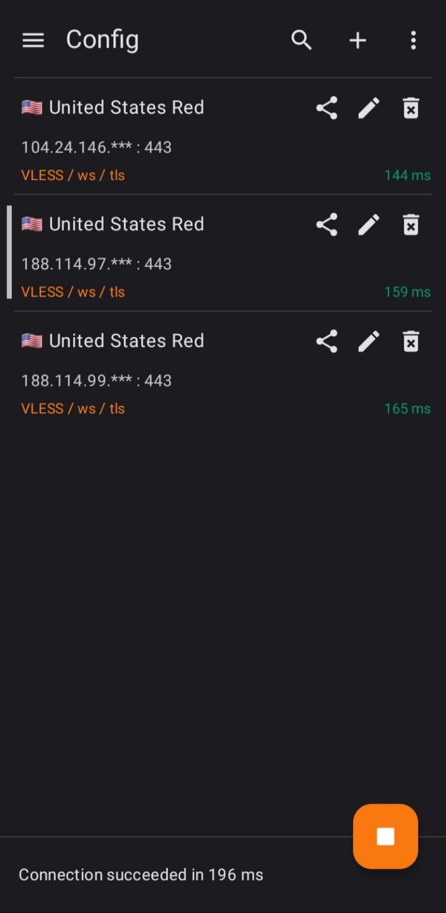
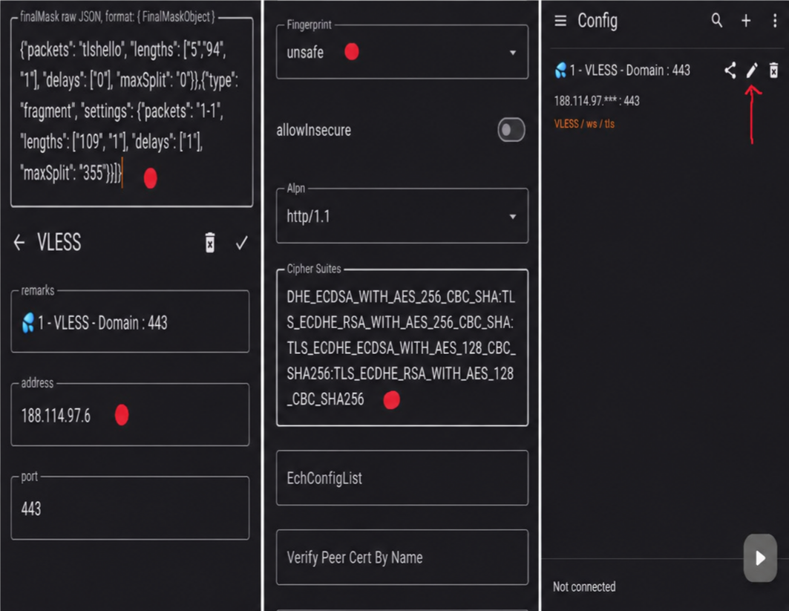

<div align="center">


<h3>پیدا کردن تمیزترین، سریع‌ترین و پایدارترین IP های کلادفلر</h3>
<p>مستقیم از مرورگر — بدون نیاز به نصب — با اسکن دومرحله‌ای دقیق</p>

<p>
  <a href="https://codewave4.github.io/Scanner/"></a>
  <a href="https://t.me/RedProjectX"></a>
  <a href="#-آموزش-fragment--fingerprint-با-pattng"></a>
</p>

<br>

<p>
  
  
  
  
  
</p>

</div>

---

## ✨ ویژگی‌ها

<div align="center">
<table>
<tr>
<td>⚡ <b>بدون نصب</b></td>
<td>🎯 <b>اسکن دومرحله‌ای</b></td>
<td>🧠 <b>امتیازدهی هوشمند</b></td>
</tr>
<tr>
<td>🛡️ <b>نشان تأیید IP تمیز</b></td>
<td>🚫 <b>تشخیص نیمه‌مسدودها</b></td>
<td>📶 <b>کالیبراسیون پینگ پایه</b></td>
</tr>
<tr>
<td>🌐 <b>رنج سفارشی (CIDR)</b></td>
<td>🔌 <b>تست چند پورت TLS</b></td>
<td>💾 <b>حافظه IP های خوب</b></td>
</tr>
<tr>
<td>📊 <b>نمودار زنده تاخیر</b></td>
<td>📋 <b>کپی / CSV / اشتراک</b></td>
<td>🌙 <b>تم تیره و روشن</b></td>
</tr>
</table>
</div>

---

## 🚀 شروع سریع

### روش ۱ — استفاده از دمو آنلاین (توصیه شده)

<div align="center">
<a href="https://codewave4.github.io/Scanner/">
  
</a>
</div>

👉 لینک مستقیم: **https://codewave4.github.io/Scanner/**

### روش ۲ — راه‌اندازی شخصی روی GitHub Pages

1. یک ریپازیتوری جدید با نام `Scanner` بسازید
2. فایل `index.html` را آپلود کنید
3. به مسیر `Settings → Pages` بروید و برنچ را روی `main` بگذارید
4. تمام! ✅ اسکنر شما روی `username.github.io/Scanner` در دسترس است

---

## 🧠 اسکنر چطور کار می‌کند؟

```
┌─────────────┐    ┌─────────────┐    ┌─────────────┐    ┌─────────────┐
│ کالیبراسیون  │ →  │   فاز ۱     │ →  │   فاز ۲     │ →  │ نتایج نهایی │
│ پینگ پایه    │    │ غربالگری    │    │ تأیید نهایی │    │  + نشان 🛡️ │
└─────────────┘    └─────────────┘    └─────────────┘    └─────────────┘
```

### 1️⃣ کالیبراسیون پینگ پایه
پینگ پایه شبکه شما با `1.1.1.1` سنجیده می‌شود تا امتیازها نسبی باشند.

### 2️⃣ فاز ۱ — غربالگری سریع
IP های تصادفی از ۱۲ رنج رسمی کلادفلر تست می‌شوند (حداکثر ۶۰ اتصال همزمان برای دقت).

### 3️⃣ فاز ۲ — تأیید نهایی (فقط برای برترها)
۲۰ آی‌پی برتر با ۴ تست تکراری + پورت دوم (2053) بررسی می‌شوند.

### 4️⃣ امتیازدهی هوشمند
```
امتیاز = (درصد موفقیت × 60%) + (کیفیت تاخیر × 25%) + (پایداری × 15%)
~~~

> 🚫 آی‌پی‌هایی که پاسخ‌های سریع مصنوعی (RST فیلترینگ) یا jitter وحشتناک می‌دهند، به‌صورت خودکار حذف یا محدود می‌شوند.

---

## 📊 راهنمای امتیاز و وضعیت

<div align="center">
<table>
<tr>
<th>امتیاز</th><th>پینگ</th><th>وضعیت</th><th>معنی</th>
</tr>
<tr>
<td><b>۹۰+</b></td>
<td>زیر ۱۰۰ms</td>
<td>🟢</td>
<td>عالی — IP تمیز و تأییدشده 🛡️</td>
</tr>
<tr>
<td><b>۷۰–۹۰</b></td>
<td>۱۰۰–۲۰۰ms</td>
<td>🟡</td>
<td>متوسط — قابل استفاده</td>
</tr>
<tr>
<td><b>زیر ۷۰</b></td>
<td>بالای ۲۰۰ms</td>
<td>🔴</td>
<td>ضعیف — توصیه نمی‌شود</td>
</tr>
</table>
</div>

> 💡 **نشان 🛡️ فقط به IP هایی می‌رسه که از فاز ۲ با موفقیت عبور کنن و پایداری واقعی داشته باشن.**

---

## 📱 آموزش fragment + fingerprint (جایگزین sni-spoofing) با PattNG

**رفع فیلتر دامنه و رفع محدودیت آپلود برای کانفیگ‌های کلادفلر (ورکر / CDN) بر روی اندروید**

> 💡 بعد از اسکن، بهترین کار اینه که IP های تمیز رو وارد برنامه **PattNG** کنین تا بهترین عملکرد رو داشته باشین. این اپ کاملاً مشابه **v2rayNG** میباشد و صرفاً امکانات اضافی مورد نیاز به آن اضافه شده است.

### 🖼 تصاویر آموزش

<div align="center">
<table>
<tr>
<th>لیست کانفیگ‌ها</th>
<th>ویرایش کانفیگ (fragment + fingerprint)</th>
</tr>
<tr>
<td></td>
<td></td>
</tr>
</table>
</div>

### 📝 مراحل انجام کار

**مرحله ۱:** ابتدا اپ **PattNG** را نصب کنید:

<div align="center">
<a href="https://github.com/patterniha/PattNG/releases">
  
</a>
</div>

🔗 https://github.com/patterniha/PattNG/releases

**مرحله ۲:** کانفیگ خود را وارد برنامه کنید و **edit** (علامت مداد ✏️) را بزنید.

**مرحله ۳:** در قسمت **address** مقدار `188.114.97.6` و یا هر آیپی سالم دیگر کلادفلر را وارد کنید.

**مرحله ۴:** در قسمت **finalMask** کل عبارت زیر را وارد کنید:

```json
{"tcp": [{"type": "fragment", "settings": {"packets": "tlshello", "lengths": ["5", "94", "1"], "delays": ["0"], "maxSplit": "0"}},{"type": "fragment", "settings": {"packets": "1-1", "lengths": ["109", "1"], "delays": ["1"], "maxSplit": "355"}}]}
```

**مرحله ۵:** نوع فینگرپرینت (**fingerprint**) را روی `unsafe` انتخاب کنید.

**مرحله ۶:** در قسمت **cipherSuites** کل عبارت زیر را وارد کنید:

~~~
TLS_AES_256_GCM_SHA384:TLS_CHACHA20_POLY1305_SHA256:TLS_AES_128_GCM_SHA256:TLS_ECDHE_ECDSA_WITH_AES_256_GCM_SHA384:TLS_ECDHE_RSA_WITH_AES_256_GCM_SHA384:TLS_ECDHE_ECDSA_WITH_AES_128_GCM_SHA256:TLS_ECDHE_RSA_WITH_AES_128_GCM_SHA256:TLS_ECDHE_ECDSA_WITH_CHACHA20_POLY1305_SHA256:TLS_ECDHE_RSA_WITH_CHACHA20_POLY1305_SHA256:TLS_ECDHE_ECDSA_WITH_AES_256_CBC_SHA:TLS_ECDHE_RSA_WITH_AES_256_CBC_SHA:TLS_ECDHE_ECDSA_WITH_AES_128_CBC_SHA256:TLS_ECDHE_RSA_WITH_AES_128_CBC_SHA256
```

**مرحله ۷:** سیو کنید و تمام ✅

### 📖 آموزش ویدیویی کامل (تلگرام)

<div align="center">
<a href="https://t.me/patt_channel_x/94?single">
  
</a>
</div>

🔗 https://t.me/patt_channel_x/94?single

---

## ❓ سوالات متداول

<details>
<summary><b>❔ چرا بعضی IP ها نشان 🛡️ ندارن؟</b></summary>
<br>نشان سپر فقط به IP هایی می‌رسه که از فاز ۲ (تأیید نهایی) با موفقیت عبور کنن: پینگ پایدار، jitter کم و پاسخ‌دهی روی چند پورت.
</details>

<details>
<summary><b>❔ چرا همه نتایج زرد یا قرمزن؟</b></summary>
<br>یعنی از سمت شبکه شما اکثر رنج‌ها محدود (throttle) شدن. این راه‌حل‌ها رو امتحان کن:
- تعداد کل IP ها رو بیشتر کن (۱۰۰ تا ۲۰۰۰)
- در ساعات خلوت‌تر (بامداد) اسکن کن
- از IP های ذخیره‌شده قبلی استفاده کن
</details>

<details>
<summary><b>❔ آیا نتیجه ۱۰۰٪ دقیقته؟</b></summary>
<br>مرورگر اجازه اتصال TCP مستقیم نمی‌دهد؛ بنابراین تست بر اساس زمان پاسخ HTTPS + تست‌های تکراری انجام می‌شود که خطا را به حداقل می‌رساند، اما صفر نمی‌کند.
</details>

<details>
<summary><b>❔ چطور رنج سفارشی اضافه کنم؟</b></summary>
<br>در تنظیمات اسکن، منبع IP را روی «رنج سفارشی» بگذار و رنج‌ها را به فرمت CIDR یا IP وارد کنید:

```
198.41.223.0/24
104.16.0.0/20
172.64.10.7
```
</details>

<details>
<summary><b>❔ بهترین پورت برای تست کدومه؟</b></summary>
<br>پورت‌های پشتیبانی‌شده: <b>443, 2053, 2083, 2087, 2096, 8443</b> — پورت <b>443</b> پیش‌فرض و در اکثر مواقع بهترین گزینه است.
</details>

---

## 🖼 اسکرین‌شات اسکنر

<div align="center">
<i>📸 اسکرین‌شات‌های اسکنر به‌زودی اضافه می‌شوند...</i>
</div>

---

## 🔗 لینک‌های مفید

<div align="center">
<table>
<tr>
<td>✈️ <b>کانال تلگرام</b></td>
<td><a href="https://t.me/RedProjectX">@RedProjectX</a></td>
</tr>
<tr>
<td>📱 <b>PattNG (گیت‌هاب)</b></td>
<td><a href="https://github.com/patterniha/PattNG/releases">Releases</a></td>
</tr>
<tr>
<td>📖 <b>آموزش رفع محدودیت</b></td>
<td><a href="https://t.me/patt_channel_x/94?single">تلگرام</a></td>
</tr>
<tr>
<td>🌐 <b>دمو آنلاین</b></td>
<td><a href="https://codewave4.github.io/Scanner/">codewave4.github.io/Scanner</a></td>
</tr>
</table>
</div>

---

## 🤝 مشارکت

اگه ایده‌ای داری یا باگی پیدا کردی، خوشحال می‌شم Pull Request یا Issue بدی!

---

<div align="center">

### ساخته‌شده با ❤️ برای دور زدن محدودیت‌ها

**اگه این پروژه برات مفید بود، یه ⭐ بده!**

<a href="https://codewave4.github.io/Scanner/">
  
</a>

</div>
